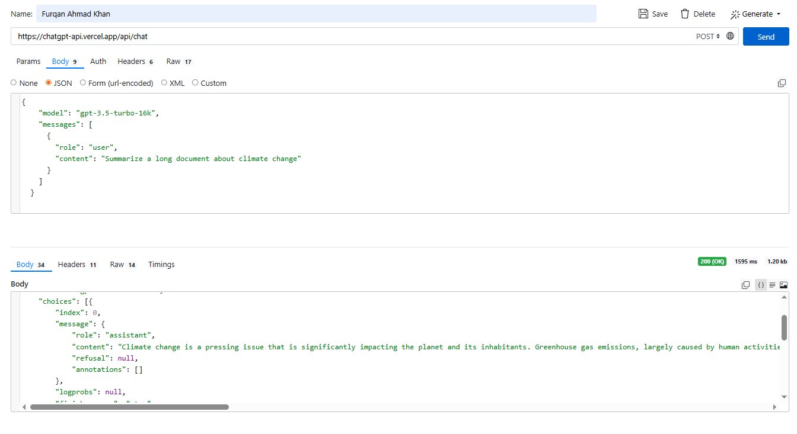

# OpenProxyAIFree

A reverse API proxy for accessing ChatGPT models through third-party services. This project provides a simple interface to interact with various GPT models without requiring official OpenAI API keys.



> **⚠️ DISCLAIMER**: This project is strictly for educational and testing purposes only. It is not actively maintained and should not be used in production environments. The service may be discontinued at any time without notice.

**Last Updated**: March 22, 2026 at 5:00 PM (Sunday)  
**Tested**: March 22, 2026 - See [test_results.md](test_results.md) for current model status

---

## 📋 Table of Contents

- [Original Website](#original-website)
- [Supported Models](#supported-models)
- [API Endpoint](#api-endpoint)
- [Installation](#installation)
- [Usage Examples](#usage-examples)
- [cURL Commands for Each Model](#curl-commands-for-each-model)
- [Implementation Files](#implementation-files)
- [Response Format](#response-format)
- [Legal Notice](#legal-notice)
- [Limitations](#limitations)

---

## 🌐 Original Website

**Service URL**: [https://chatgpt-api.vercel.app/](https://chatgpt-api.vercel.app/)

**API Endpoint**: `https://chatgpt-api.vercel.app/api/chat`

**Test Online**: [https://reqbin.com/trjnxxyn](https://reqbin.com/trjnxxyn) - Try the API directly in your browser without any setup

---

## 🤖 Supported Models

The following models are available through this proxy. Operational status is verified as of the last update.

| Model Name | Status | Description |
|------------|--------|-------------|
| `gpt-4o` | ✅ Operational | GPT-4 Optimized - Latest optimized version |
| `o4-mini` | ✅ Operational | Lightweight O-series model version 4 |
| `gpt-4.1` | ✅ Operational | GPT-4.1 - Enhanced version |
| `gpt-4.1-mini` | ✅ Operational | GPT-4.1 Mini - Lightweight version |
| `gpt-3.5-turbo` | ✅ Operational | GPT-3.5 Turbo - Fast and efficient |
| `gpt-3.5-turbo-16k` | ✅ Operational | GPT-3.5 Turbo - Extended context (16k tokens) |
| `gpt-4-turbo` | ⚠️ Timeout Issues | GPT-4 Turbo - Currently experiencing deployment timeouts |
| `gpt-4` | ⚠️ Timeout Issues | GPT-4 - Currently experiencing deployment timeouts |
| `o3` | ⚠️ Timeout Issues | O-series model version 3 - Currently experiencing deployment timeouts |

> Models marked with ⚠️ may be temporarily unavailable. See [test_results.md](test_results.md) for detailed testing information.

---

## 📦 Installation

### Python Requirements

```bash
pip install requests
```

### JavaScript/Node.js Requirements

```bash
npm install node-fetch
# or
npm install axios
```

---

## 🚀 Usage Examples

### Quick Start

The API accepts POST requests with a JSON payload containing the model name and conversation messages.

**Basic Request Structure:**

```json
{
  "model": "gpt-3.5-turbo",
  "messages": [
    {
      "role": "user",
      "content": "Your question here"
    }
  ]
}
```

---

## 📝 cURL Commands for Each Model

### GPT-4o

```bash
curl -X POST https://chatgpt-api.vercel.app/api/chat \
  -H "Content-Type: application/json" \
  -d '{
    "model": "gpt-4o",
    "messages": [
      {
        "role": "user",
        "content": "Explain quantum computing in simple terms"
      }
    ]
  }'
```

### O3

```bash
curl -X POST https://chatgpt-api.vercel.app/api/chat \
  -H "Content-Type: application/json" \
  -d '{
    "model": "o3",
    "messages": [
      {
        "role": "user",
        "content": "What are the benefits of machine learning?"
      }
    ]
  }'
```

### O4-Mini

```bash
curl -X POST https://chatgpt-api.vercel.app/api/chat \
  -H "Content-Type: application/json" \
  -d '{
    "model": "o4-mini",
    "messages": [
      {
        "role": "user",
        "content": "Write a haiku about programming"
      }
    ]
  }'
```

### GPT-4.1

```bash
curl -X POST https://chatgpt-api.vercel.app/api/chat \
  -H "Content-Type: application/json" \
  -d '{
    "model": "gpt-4.1",
    "messages": [
      {
        "role": "user",
        "content": "Explain the theory of relativity"
      }
    ]
  }'
```

### GPT-4.1-Mini

```bash
curl -X POST https://chatgpt-api.vercel.app/api/chat \
  -H "Content-Type: application/json" \
  -d '{
    "model": "gpt-4.1-mini",
    "messages": [
      {
        "role": "user",
        "content": "What is the capital of France?"
      }
    ]
  }'
```

### GPT-4-Turbo

```bash
curl -X POST https://chatgpt-api.vercel.app/api/chat \
  -H "Content-Type: application/json" \
  -d '{
    "model": "gpt-4-turbo",
    "messages": [
      {
        "role": "user",
        "content": "Generate a Python function to sort a list"
      }
    ]
  }'
```

### GPT-4

```bash
curl -X POST https://chatgpt-api.vercel.app/api/chat \
  -H "Content-Type: application/json" \
  -d '{
    "model": "gpt-4",
    "messages": [
      {
        "role": "user",
        "content": "Describe the water cycle"
      }
    ]
  }'
```

### GPT-3.5-Turbo

```bash
curl -X POST https://chatgpt-api.vercel.app/api/chat \
  -H "Content-Type: application/json" \
  -d '{
    "model": "gpt-3.5-turbo",
    "messages": [
      {
        "role": "user",
        "content": "Hello, how are you?"
      }
    ]
  }'
```

### GPT-3.5-Turbo-16k

```bash
curl -X POST https://chatgpt-api.vercel.app/api/chat \
  -H "Content-Type: application/json" \
  -d '{
    "model": "gpt-3.5-turbo-16k",
    "messages": [
      {
        "role": "user",
        "content": "Summarize a long document about climate change"
      }
    ]
  }'
```

---

## 💻 Implementation Files

### Python Implementation

See `chatgpt_proxy.py` for a complete Python implementation with support for all models.

**Quick Example:**

```python
from chatgpt_proxy import ChatGPTProxy

# Initialize the proxy
proxy = ChatGPTProxy()

# Send a message
response = proxy.chat("gpt-3.5-turbo", "Hello, how are you?")
print(response)
```

### JavaScript Implementation

See `chatgpt_proxy.js` for a complete JavaScript/Node.js implementation with support for all models.

**Quick Example:**

```javascript
const ChatGPTProxy = require('./chatgpt_proxy');

// Initialize the proxy
const proxy = new ChatGPTProxy();

// Send a message
proxy.chat('gpt-3.5-turbo', 'Hello, how are you?')
  .then(response => console.log(response));
```

---

## 📤 Response Format

The API returns responses in OpenAI's standard chat completion format:

```json
{
  "id": "chatcmpl-DMBo5lF78IrP8ImDqNBCXmkSRdL06",
  "object": "chat.completion",
  "created": 1774180973,
  "model": "gpt-3.5-turbo-0125",
  "choices": [
    {
      "index": 0,
      "message": {
        "role": "assistant",
        "content": "Hello! I'm just a computer program, so I don't have feelings, but I'm here and ready to help with anything you need. How can I assist you today?",
        "refusal": null,
        "annotations": []
      },
      "logprobs": null,
      "finish_reason": "stop"
    }
  ],
  "usage": {
    "prompt_tokens": 12,
    "completion_tokens": 36,
    "total_tokens": 48,
    "prompt_tokens_details": {
      "cached_tokens": 0,
      "audio_tokens": 0
    },
    "completion_tokens_details": {
      "reasoning_tokens": 0,
      "audio_tokens": 0,
      "accepted_prediction_tokens": 0,
      "rejected_prediction_tokens": 0
    }
  },
  "service_tier": "default",
  "system_fingerprint": null
}
```

### Response Fields

- **id**: Unique identifier for the completion
- **object**: Type of object returned (chat.completion)
- **created**: Unix timestamp of creation
- **model**: Model used for generation
- **choices**: Array of completion choices
  - **message**: The generated message
    - **role**: Role of the message sender (assistant)
    - **content**: The actual response text
  - **finish_reason**: Reason for completion (stop, length, etc.)
- **usage**: Token usage statistics
  - **prompt_tokens**: Tokens in the prompt
  - **completion_tokens**: Tokens in the completion
  - **total_tokens**: Total tokens used

---

## ⚖️ Legal Notice

### Terms of Use

**IMPORTANT**: By using this proxy service, you acknowledge and agree to the following terms:

1. **Educational Purpose Only**: This project is intended solely for educational, research, and testing purposes. It is not designed or intended for commercial use or production environments.

2. **No Warranty**: This software is provided "AS IS" without warranty of any kind, express or implied, including but not limited to the warranties of merchantability, fitness for a particular purpose, and noninfringement.

3. **Third-Party Service**: This proxy relies on third-party services that are not affiliated with, endorsed by, or connected to OpenAI. The availability, reliability, and functionality of this service are entirely dependent on the third-party provider.

4. **No Official Support**: This project is not maintained or supported by OpenAI or any official entity. There is no guarantee of updates, bug fixes, or continued availability.

5. **Rate Limiting**: The service may implement rate limiting, throttling, or other restrictions at any time without notice.

6. **Data Privacy**: Be cautious about sending sensitive, personal, or confidential information through this proxy. The data may be processed by third-party services with their own privacy policies.

7. **Compliance**: Users are responsible for ensuring their use of this service complies with all applicable laws, regulations, and terms of service of relevant parties.

8. **Liability**: The creators and contributors of this project shall not be held liable for any damages, losses, or issues arising from the use or inability to use this service.

9. **OpenAI Terms**: This project does not grant you any rights under OpenAI's terms of service. Users should review and comply with OpenAI's official terms and policies.

10. **Discontinuation**: This service may be discontinued at any time without prior notice or explanation.

### Intellectual Property

- OpenAI, ChatGPT, GPT-3.5, GPT-4, and related trademarks are the property of OpenAI, L.P.
- This project is not affiliated with, endorsed by, or sponsored by OpenAI
- All model names and references are used for identification purposes only

### Responsible Use

Users of this proxy service are expected to:

- Use the service ethically and responsibly
- Not use the service for illegal activities
- Not attempt to abuse, exploit, or overload the service
- Respect the intellectual property rights of others
- Not use the service to generate harmful, misleading, or malicious content

### Indemnification

By using this service, you agree to indemnify and hold harmless the project creators, contributors, and maintainers from any claims, damages, losses, liabilities, and expenses arising from your use of the service.

---

## ⚠️ Limitations

### Current Service Status

Based on recent testing (March 22, 2026):
- 6 out of 9 models are fully operational
- 3 models (gpt-4, gpt-4-turbo, o3) are experiencing timeout errors
- Operational models include: gpt-4o, gpt-4.1, gpt-4.1-mini, o4-mini, gpt-3.5-turbo, gpt-3.5-turbo-16k

For detailed test results, see [test_results.md](test_results.md).

### Known Limitations

1. **Availability**: Service uptime depends entirely on third-party infrastructure
2. **Rate Limits**: Requests may be throttled without warning
3. **Model Availability**: Some models may timeout or become unavailable
4. **Response Quality**: May differ from official OpenAI API responses
5. **No Streaming**: Real-time streaming responses are not supported
6. **Context Windows**: Actual context limits may vary from official specifications
7. **No Authentication**: No API key management or user authentication system
8. **No SLA**: Zero guarantees on uptime, performance, or support

### Security Considerations

- Do not send sensitive or confidential information
- Do not use for applications requiring high security
- Be aware that requests may be logged by third-party services
- No encryption guarantees beyond standard HTTPS

### Performance

- Response times may be slower than official API
- Concurrent request handling may be limited
- No guaranteed throughput or latency

---

## 🔧 Troubleshooting

### Common Issues

**Service Unavailable (503)**  
The backend service is down. Wait a few minutes and retry.

**Rate Limit Exceeded (429)**  
Too many requests in a short period. Implement exponential backoff in your retry logic.

**Timeout Errors (FUNCTION_INVOCATION_TIMEOUT)**  
Certain models (gpt-4, gpt-4-turbo, o3) are currently experiencing deployment timeouts. Try using alternative models like gpt-4o or gpt-4.1 instead.

**Invalid Model Error**  
Double-check the model name spelling. Refer to the supported models table for exact names.

**Connection Timeouts**  
Network issues or slow responses. Consider increasing your client timeout settings or using a lighter model.

---

## 📞 Support

This project is not actively maintained. For issues or questions:

- Check the troubleshooting section above
- Review the implementation files for examples
- Verify the original service is operational

---

## 📄 License

This project is provided as-is for educational and testing purposes only. No license is granted for commercial use.

---

## 🙏 Acknowledgments

- Original service provider: [https://chatgpt-api.vercel.app/](https://chatgpt-api.vercel.app/)
- OpenAI for developing the underlying models
- The open-source community

---

**Last Updated**: March 22, 2026 at 5:00 PM (Sunday)

**Version**: 1.0.0

**Status**: Experimental / Not Maintained

---

*Remember: This is an unofficial proxy service for testing purposes only. For production use, please use the official OpenAI API.*

## 💖 Created By

Created with ❤️ by [FurqanAhmadKhan](https://github.com/FurqanAhmadKhan)

⭐ Don't forget to star the repo if you find it useful!

---

